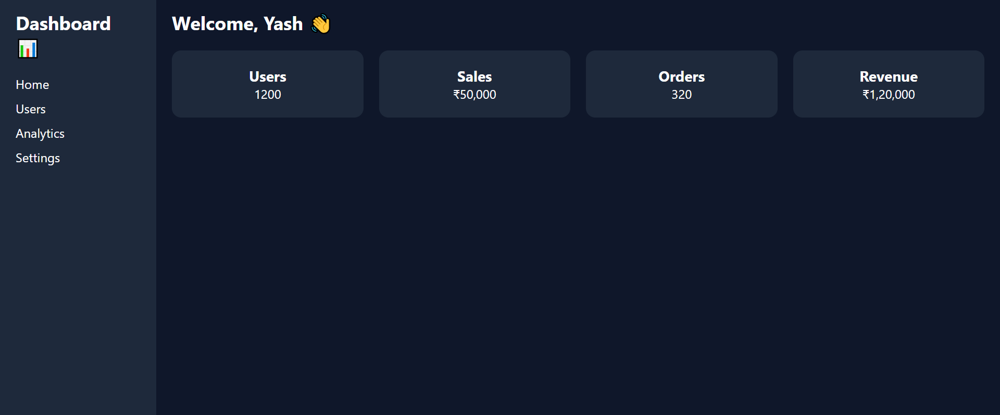

# 📊 Admin Dashboard UI - Day 1 Project 20

## 📌 Project Overview

This project is a modern **Admin Dashboard UI** created as part of my semester challenge to build 200 websites.

It represents a professional dashboard interface used in real-world applications to manage users, sales, and analytics.

---

## 🎯 Features

* 📊 Sidebar Navigation Menu
* 🧭 Header Section
* 📈 Dashboard Cards (Users, Sales, Orders, Revenue)
* 📱 Responsive Grid Layout
* 🎨 Clean and Professional UI

---

## 🛠️ Technologies Used

* HTML5
* CSS3 (Flexbox + Grid)

---

## 📂 Project Structure

```id="h7k2m8"
site-20-admin-dashboard/
│
├── index.html
├── style.css
├── preview.png
└── README.md
```

---

## 📸 Preview



---

## 💡 Learning Outcome

* Learned dashboard layout design
* Practiced sidebar + main content structure
* Used Flexbox and Grid together
* Built real-world admin UI
* Strengthened Git & GitHub workflow

---

## 🔥 Author

**Yash Patil**
Future Data Engineer 🚀

---

## ⭐ Note

This project is part of my goal to build **200 websites** to improve my web development and design skills.
